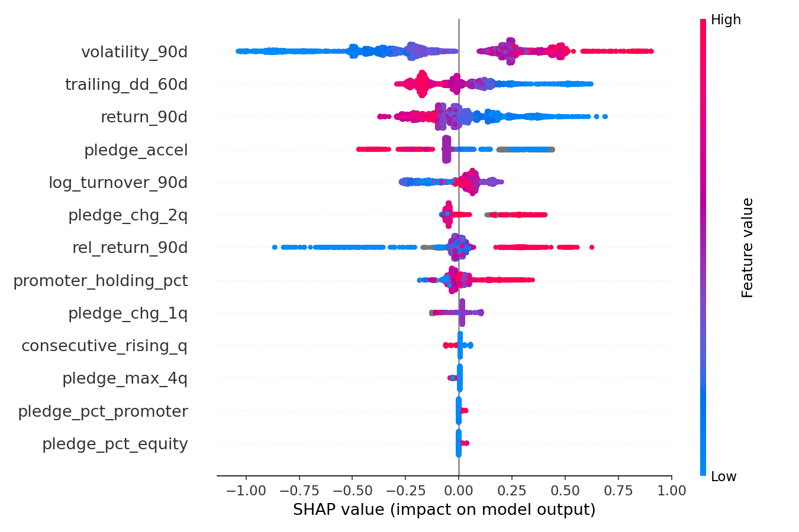
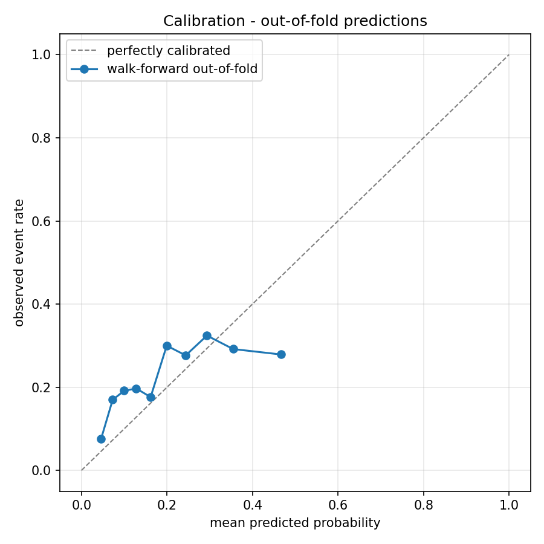

# 🚀 PledgeCast

**An AI-powered early-warning system for predicting stock crashes in the Indian Stock Market.**

[](https://www.python.org/downloads/release/python-3110/)
[](https://fastapi.tiangolo.com/)
[](https://streamlit.io/)
[](https://xgboost.readthedocs.io/)
[](#limitations-honest-research)

______________________________________________________________________

## 📖 Executive Summary

When company founders (promoters) pledge their shares for loans, the financial market often views it as a critical risk. If the stock price falls, banks might liquidate those pledged shares, triggering a massive, uncontrollable stock crash.

**PledgeCast** is a complete, end-to-end Machine Learning system built to test this theory. It analyzes 5 years of financial data for 300 top Indian companies (the NIFTY 500) to predict the risk of a stock crashing within the next 60 days.

It is a production-ready application featuring:

1. An automated data pipeline built on SQLite.
1. A trained XGBoost Machine Learning model.
1. A REST API backend (FastAPI).
1. An interactive web dashboard (Streamlit).

______________________________________________________________________

## 💡 The Core Discovery

We asked the AI a simple question: **Does promoter pledging actually predict stock crashes?**

**The Answer:** No!

While highly pledged companies *are* statistically riskier, our AI model discovered that this risk is completely explained by normal market volatility and trading volume. Once you account for how volatile a stock is, the pledge data itself adds **zero** extra warning.

### Proof: The SHAP Confound Audit

The graph below explains exactly how our AI makes decisions. Notice how the market features (Volatility, Drawdown, Returns) completely dominate the decision-making process, while the Pledge features cluster near zero importance.


*The confound audit: Market features dominate; pledge features add almost zero predictive power.*

This is a powerful finding: it proves that simply screening for "high promoter pledges" (like many financial websites do) is not a magic bullet for predicting crashes.

______________________________________________________________________

## 📊 Model Performance & Validation

We rely on strict out-of-sample, walk-forward validation (never random k-fold) to ensure our AI doesn't peek at future data. The model proves highly stable across quarters.


*Model Calibration across 11 forward-testing folds.*

______________________________________________________________________

## 🛠️ Tech Stack & Architecture

PledgeCast is built using modern, industry-standard tools without over-engineering the solution:

- **Database:** `SQLite` & `SQLAlchemy Core` (Stores parsed financial filings, historical prices, and predictions without the bloat of an ORM)
- **Machine Learning:** `Python`, `XGBoost`, `Scikit-Learn`
- **Explainable AI:** `SHAP` (Explains exactly *why* the AI made a prediction in plain English)
- **Backend API:** `FastAPI` (Serves predictions instantly via REST endpoints)
- **Frontend Dashboard:** `Streamlit` (Provides beautiful, interactive charts and stock scanners)

______________________________________________________________________

## 💻 Quickstart: Run It Locally

Running the project is incredibly simple. Open your terminal in the `pledgecast_v2` folder and run these two commands.

### 1. Start the AI Backend API

This starts the core engine that generates predictions.

```bash
set PYTHONPATH=D:\pledgecast_v2\src;D:\pledgecast_v2
D:\pledgecast_v2\.venv\Scripts\uvicorn.exe pledgecast.api.main:app --app-dir src --port 8000
```

*Once running, view the interactive API docs at: **<http://127.0.0.1:8000/docs>***

### 2. Start the User Dashboard

Open a **new** terminal window and run this to start the user interface:

```bash
set PYTHONPATH=D:\pledgecast_v2\src;D:\pledgecast_v2
D:\pledgecast_v2\.venv\Scripts\streamlit.exe run dashboard\app.py
```

*The dashboard will automatically open in your browser at: **<http://localhost:8501>***

______________________________________________________________________

## 📱 System Components

### The User Dashboard

The web app has three main pages:

1. **Risk Scanner:** A live, ranked watchlist of the riskiest stocks right now.
1. **Stock Investigator:** A deep dive into a single stock. See its price history, its pledge history, and exactly why the AI thinks it is safe or risky.
1. **Model Validation:** Transparent proof showing how accurate the AI model is.

### The API Endpoints

Other applications can talk to PledgeCast to get instant risk scores!

- `GET /health` - Checks if the system and AI model are running.
- `GET /model-info` - Returns details about how the AI was trained.
- `POST /predict` - Send a stock symbol and get back a risk score (Low/Medium/High) and a plain-English explanation.
- `GET /predictions` - Retrieve historical predictions.

______________________________________________________________________

## Limitations (Honest Research)

As a transparent Data Science project, we acknowledge a few limitations:

- **Survivorship Bias:** The data looks at today's top 500 companies. Companies that completely collapsed 3 years ago are not in the dataset.
- **Market Cycles:** The 5-year study period (2021-2026) is shorter than a full, long-term economic cycle.
- **Not Investment Advice:** This system is a showcase of Data Science, Machine Learning, and Software Engineering skills, not a tool for live trading.
